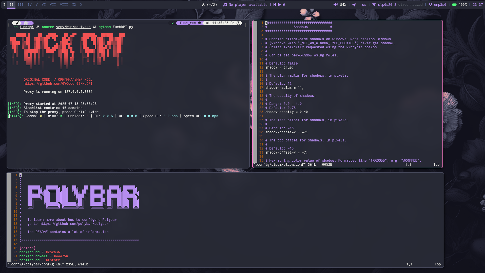
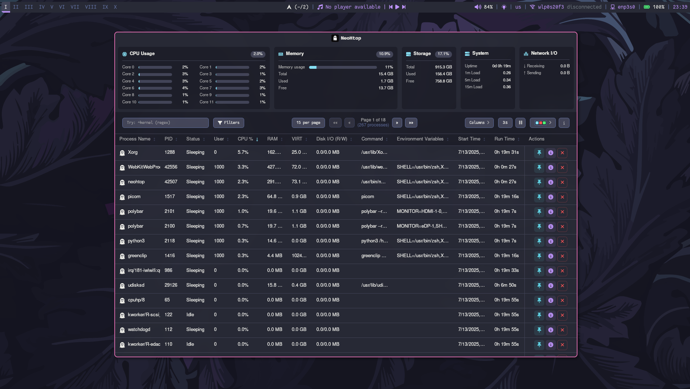

# Что это

**Мои dotfiles в стиле [dracula](https://draculatheme.com/) для [Arch Linux.](https://archlinux.org/)**

_Обратите внимание, что данный rice довольно минималистичный и **включает в себя только самое необходимое.** Здесь нет музыкальных визуализаторов, анимаций, цикличных обоев и виджетов. В случае необходимости вы можете сами добавить и изменить все, что вам потребуется._

***

# Как это выглядит
## Скриншоты






***

# Основная информация
- **OS:** [Arch Linux](https://archlinux.org/)
- **WM:** [bspwm](https://wiki.archlinux.org/title/Bspwm)
- **Compositor:** [picom (ftlabs)](https://aur.archlinux.org/packages/picom-ftlabs-git)
- **Animations:** none
- **QT/GTK theme:** [dracula (GTK)](https://draculatheme.com/gtk), [dracula-qt5ct]([qt5 • Dracula Theme](https://draculatheme.com/qt5))
- **Bar:** [polybar](https://github.com/polybar/polybar)
- **Launcher:** [rofi](https://github.com/davatorium/rofi)
- **File manager:** [ranger](https://github.com/ranger/ranger) and [nemo](https://github.com/linuxmint/nemo)
- **Calendar:** none (I don't use a calendar)
- **System monitor:** [NeoHtop](https://github.com/Abdenasser/neohtop)
- **Music player:** [cmus](https://github.com/cmus/cmus)
- **Clipboard:** [greenclip](https://github.com/erebe/greenclip)
- **Terminal:** [kitty](https://sw.kovidgoyal.net/kitty/)
- **Shell:** Zsh (+ [oh-my-zsh](https://github.com/ohmyzsh/ohmyzsh/) + [powerlevel10k](https://github.com/romkatv/powerlevel10k))
- **Fetch:** [neofetch](https://github.com/dylanaraps/neofetch)
- **Authentication agent:** [mate-polkit](https://github.com/mate-desktop/mate-polkit)
- **Screen lock:** [xss-lock](https://man.archlinux.org/man/xss-lock.1) + [xsecurelock](https://github.com/google/xsecurelock)
- **Display manager:** [lightdm](https://github.com/canonical/lightdm) ([gtk greeter](https://github.com/canonical/lightdm))
- **Power menu:** my rofi script
- **Wi-Fi menu:** [rofi-wifi-menu](https://github.com/zbaylin/rofi-wifi-menu)
- **Bluetooth connections:** [bluetui](https://github.com/pythops/bluetui)
- **Font:** [otf-fantasque-sans-mono](https://github.com/belluzj/fantasque-sans)
***

# Обои
Находятся в директории [.backgrounds](/src/dotfiles/backgrounds).

***

# Важные нюансы
## LightDM
Обязательно должен быть доступ к директории `/usr/share/pixmaps`, чтобы можно было применить фоновое изображение. Для этого меняем права:
`sudo chmod 555 -R /usr/share/pixmaps`

## Zsh
Загляните в [.zshrc](/src/dotfiles/zshrc) и посмотрите на алиасы (aliases). Там есть некоторые модификации, которые связаны с заменой стандартных команд. Например, вместо `ls` используется `lsd`:
(images/aliases.png)

## Блокировка экрана
Для блокировки экрана используется [xsecurelock.](https://github.com/google/xsecurelock) Это очень минималистичный консольный менеджер блокировки, который не включает в себя установку фонового изображения, анимаций или чего-то подобного, поэтому вы можете захотеть заменить его на что-то более кастомизируемое и красивое.

## Хоткеи
Основные хоткеи для работы (отредактируйте файл [sxhkdrc](/src/dotfiles/config/sxhkd/sxhkdrc), если хотите их изменить):
```
Открыть терминал kitty: super + enter;
Открыть rofi: super + d;
Открыть power menu: super + XF86Tools;
Открыть историю greenclip: super + space;
Открыть файловый менеджер ranger: super + e;
Открыть файловый менеджер nemo: super + shift + e
Открыть firefox: super + f;
Открыть obsidian: super + o;
Открыть vs code: super + v;
Сделать скриншот: super + PrtSc;
Открыть cmus: super + shift + m;
Заблокировать экран: super + x;
Перезапустить sxhkd: super + ctrl + enter;
Перезапустить bspwm config: super + alt + enter;
Выйти из bspwm: super + alt + q;
Перезапустить setxkbmap: super + shift + k
```


## Звук
Для быстрого управления звуком можно использовать хоткеи или [модуль polybar.](https://github.com/polybar/polybar/wiki/Module:-pulseaudio) Никаких виджетов для управления звуком тут нету. Для продвинутой настройки звука используется [pacmixer.](https://github.com/KenjiTakahashi/pacmixer)

## Автозапуск
**В автозапуске через [.xprofile](/src/dotfiles/xprofile):**
- `setxkbmap` для настройки английской и русской раскладки клавиатуры, меняется по сочетанию клавиш Alt + Shift;
- `numlockx` для автоматического запуска numpad'а на клавиатуре;
- `mate-polkit-authentication-agent` для запросов аутентификации с привелегиями root;
- `greenclip` в качестве менеджера буфер обмены;
- `dunst` для просмотра и управления уведомлениями;
- `xset` и `xss-lock` для автоматической блокировки экрана, в случае бездействия пользователя в течении 300 секунд (если проигрывается видео, экран не блокируется автоматически).

**В автозапуске через [bspwmrc](/src/dotfiles/config/bspwm/bspwmrc):**
- `dual_monitor.sh` для автоматического определения и настройки мониторов;
- `polybar_dual_monitor.sh` для автоматического запуска polybar на 2-ух мониторах;
- `feh` для установки фонового изображения на рабочий стол;
- `picom` в качестве композитора.

## Правила окон в bspwmrc
- `ranger`, `nemo`, `gtk-chtheme`, `pacmixer`, `bluetui` и `cmus` запускаются в плавающем режиме с фиксированными размерами и положениями на экране;
- `ark`, `feh`, `dconf-editor`, `qt5ct`, `qt6ct` и `nm-connection-editor` запускаются в плавающем режиме без фиксированных размеров и положений на экране.

## Picom
Установлен [форк picom.](https://aur.archlinux.org/packages/picom-ftlabs-git) Он правильно работает с рамками окон и я советую устанавливать именно его для bspwm.

***

# Как установить
Вы можете почитать [данную статью,](https://teletype.in/@chernoff_security/arch_bspwm_dracula) чтобы посмотреть пример установки bspwm с темой dracula.
